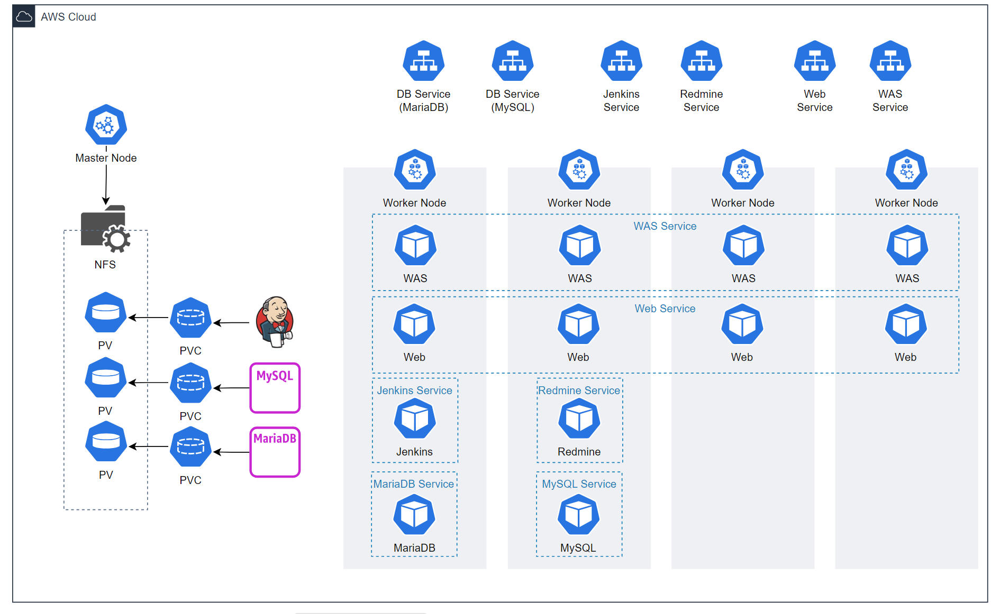
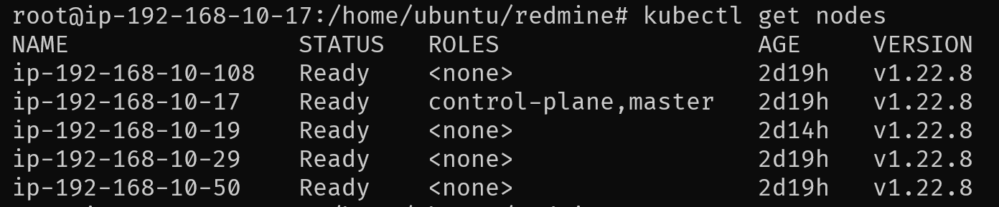
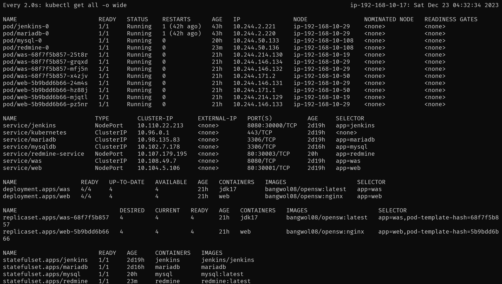

# k8s-openSW
2023-2 openSW TeamProject task

## Apply
### Jenkins
```bash
# Create Jenkins PV & PVC
kubectl apply -f jenkins_pv.yaml

# Create Jenkins StatefulSet
kubectl apply -f jenkins_state.yaml

# Create Jenkins Service
kubectl apply -f jenkins_service.yaml
```
### DB(MariaDB)
```bash
# Create DB PV & PVC
kubectl apply -f db_pv.yaml

# Create DB Secret
kubectl apply -f db_secret.yaml

# Create DB StatefulSet
kubectl apply -f db_state.yaml

# Create DB Service
kubectl apply -f db_service.yaml
```
### WAS & Web
```bash
# Create WAS Deployment
kubectl apply -f was_deployment.yaml

# Create WAS Service
kubectl apply -f was_service.yaml

# Create Web Deployment
kubectl apply -f web_deployment.yaml

# Create Web Service
kubectl apply -f web_service.yaml
```

### Redmine & DB(MySQL)
```bash
# Create DB PV & PVC
kubectl apply -f mysql_pv.yml

# Create DB StatefulSet
kubectl apply -f mysql_state.yml

# Create DB Service
kubectl apply -f mysql_service.yml

# Create Redmine PV, PVC
kubectl apply -f redmine_pv.yml

# Create Redmine StatefulSet
kubectl apply -f redmine_state.yml

# Create Redmine Service
kubectl apply -f redmine_service.yml
```

## Cluster Status Check
```bash
# Status of nodes
kubectl get nodes

# Status of all architecture 
watch kubectl get all -o wide
```

